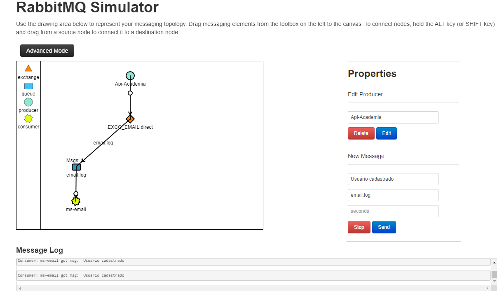

# Api-Academia

A Api-Academia é um sistema de backend desenvolvido em Java usando o framework Spring Boot. Este projeto visa facilitar o gerenciamento de clientes de uma academia, oferecendo várias funcionalidades essenciais para essa finalidade.

## Funcionalidades

### Gerenciamento de Clientes
- **Criação de Cliente**: Permite criar um novo cliente na academia, registrando suas informações básicas, como nome, idade, gênero, e-mail, etc.
- **Listagem de Clientes por Paginação**: Facilita a visualização dos clientes cadastrados, fornecendo uma interface de paginação para navegar pelos registros.
- **Listagem de Clientes Desativados**: Possibilita visualizar apenas os clientes que foram desativados, ou seja, aqueles que não estão mais ativos na academia.
- **Listagem de Clientes Ativos**: Oferece uma lista dos clientes que estão atualmente ativos na academia.
- **Busca de Cliente por ID**: Permite buscar um cliente específico com base em seu ID único.
- **Atualização de Cliente**: Permite atualizar as informações de um cliente existente na academia.
- **Exclusão de Cliente**: Permite excluir um cliente da academia.

## Microserviço de Envio de E-mail

O Microserviço de Envio de E-mail é uma parte integrante da Api-Academia. Ele é responsável por enviar e-mails para os clientes sempre que um novo cliente é cadastrado na academia. Este microserviço foi desenvolvido para fornecer uma comunicação imediata com os novos clientes, proporcionando uma experiência personalizada desde o início.

Você pode encontrar mais informações sobre o Microserviço de Envio de E-mail no seguinte repositório:
[Repositório do Microserviço de Envio de E-mail](https://github.com/seu-usuario/ms-email)



### Segurança
- **Autenticação e Autorização com JWT**: Utilizou JWT (JSON Web Tokens) para fornecer autenticação e autorização seguras. Isso permite que os clientes façam login de forma segura na API e que apenas usuários autorizados acessem determinados recursos.

## Tecnologias Utilizadas
- Java
- Spring Boot
- MySQL
- RabbitMQ
- Docker
- Swagger

## Dependências

As seguintes dependências foram utilizadas neste projeto:

- [Spring Boot Starter Data JPA](https://mvnrepository.com/artifact/org.springframework.boot/spring-boot-starter-data-jpa) - Starter para usar o Spring Data JPA para acesso a dados relacionais.
- [Spring Boot Starter Validation](https://mvnrepository.com/artifact/org.springframework.boot/spring-boot-starter-validation) - Starter para validação de entrada com Hibernate Validator.
- [Spring Boot Starter Security](https://mvnrepository.com/artifact/org.springframework.boot/spring-boot-starter-security) - Starter para configurar a segurança com o Spring Security.
- [Spring Boot Starter Web](https://mvnrepository.com/artifact/org.springframework.boot/spring-boot-starter-web) - Starter para criar aplicativos da Web com Spring MVC.
- [Flyway Core](https://mvnrepository.com/artifact/org.flywaydb/flyway-core) - Migrações de banco de dados para Java.
- [Flyway MySQL](https://mvnrepository.com/artifact/org.flywaydb/flyway-mysql) - Extensão Flyway para MySQL.
- [Spring Boot DevTools](https://mvnrepository.com/artifact/org.springframework.boot/spring-boot-devtools) - Ferramentas de desenvolvimento do Spring Boot para reinicialização automática, entre outros.
- [MySQL Connector/J](https://mvnrepository.com/artifact/mysql/mysql-connector-java) - Conector JDBC para MySQL.
- [Project Lombok](https://mvnrepository.com/artifact/org.projectlombok/lombok) - Biblioteca Java que ajuda a reduzir o código boilerplate.
- [Spring Boot Starter Test](https://mvnrepository.com/artifact/org.springframework.boot/spring-boot-starter-test) - Starter para testes de aplicativos Spring Boot com JUnit, Hamcrest, e Mockito.
- [Springdoc OpenAPI](https://mvnrepository.com/artifact/org.springdoc/springdoc-openapi-starter-webmvc-ui) - Implementação do OpenAPI para Spring Boot.
- [JJWT API](https://mvnrepository.com/artifact/io.jsonwebtoken/jjwt-api) - API para JSON Web Tokens (JWT).
- [JJWT Impl](https://mvnrepository.com/artifact/io.jsonwebtoken/jjwt-impl) - Implementação do JJWT.
- [JJWT Jackson](https://mvnrepository.com/artifact/io.jsonwebtoken/jjwt-jackson) - Suporte Jackson para JJWT.
- [Spring Rabbit Test](https://mvnrepository.com/artifact/org.springframework.amqp/spring-rabbit-test) - Testes de integração RabbitMQ para aplicativos Spring Boot.
- [Spring Boot Starter AMQP](https://mvnrepository.com/artifact/org.springframework.boot/spring-boot-starter-amqp) - Starter para integração com RabbitMQ para aplicativos Spring Boot.

## Instruções de Uso
1. Clone este repositório.
2. Execute a aplicação Spring Boot.
3. Acesse a documentação Swagger para explorar e testar as APIs disponíveis.

## Configuração do Microserviço de E-mail
1. Certifique-se de ter o RabbitMQ instalado e em execução localmente ou em um servidor acessível.
2. Execute o microserviço de envio de e-mail e configure-o para se comunicar com o RabbitMQ.

## Configuração do RabbitMQ com Docker

Para configurar o RabbitMQ utilizando Docker, você pode seguir os passos abaixo:

1. Crie um arquivo `docker-compose.yml` na raiz do seu projeto e adicione o seguinte conteúdo:

```yaml
version: "3.2"
services:
  rabbitmq:
    image: rabbitmq:3-management-alpine
    container_name: 'rabbitmq'
    ports:
      - 5672:5672
      - 15672:15672
    volumes:
      - /caminho/para/sua/pasta/data/:/var/lib/rabbitmq/
      - /caminho/para/sua/pasta/log/:/var/log/rabbitmq/
    networks:
      - rabbitmq_curso

networks:
  rabbitmq_curso:
    driver: bridge
```

## Contribuição
Contribuições são bem-vindas! Se você deseja contribuir com melhorias para este projeto, sinta-se à vontade para abrir um pull request.

## Licença
Este projeto está licenciado sob a [MIT License](https://opensource.org/licenses/MIT).
